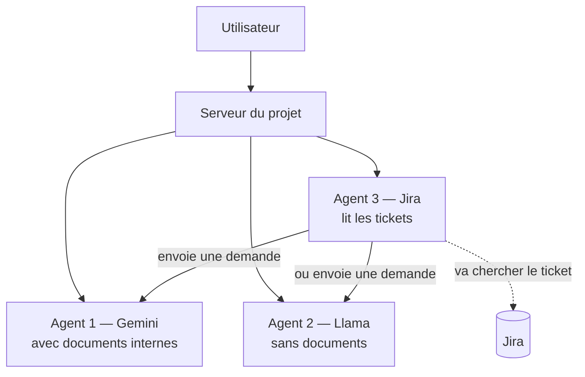
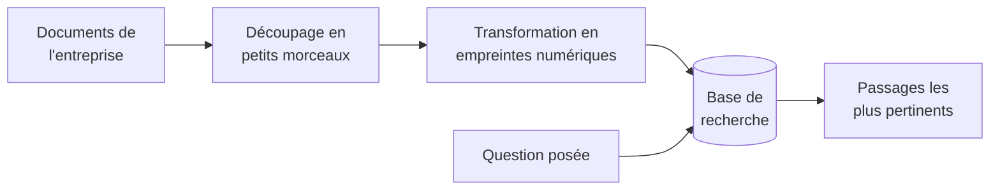
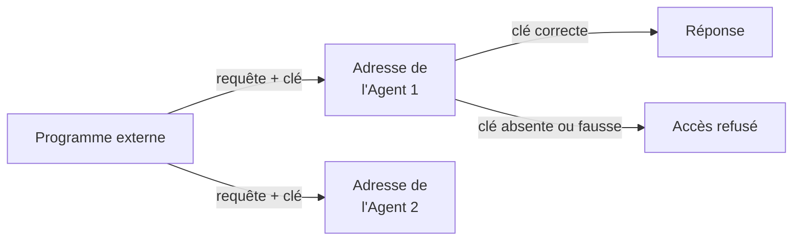
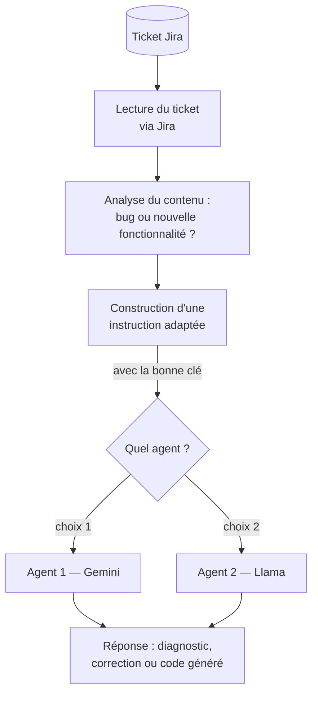
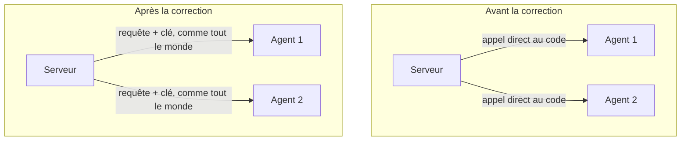

# Projet de stage — Agents IA TechNova

## En une phrase

Ce projet met en place trois assistants intelligents qui travaillent ensemble : deux d'entre eux peuvent répondre à des questions (l'un en s'appuyant sur les documents internes de l'entreprise, l'autre de façon plus libre), et le troisième sait lire un ticket de suivi de bugs (Jira) pour demander automatiquement aux deux premiers de corriger un problème ou d'écrire du code.

## Pourquoi ce projet existe

Lors d'un stage, on m'a demandé de construire un système où plusieurs intelligences artificielles collaborent, plutôt que d'utiliser une seule IA isolée. L'idée est de se rapprocher de ce qui se fait en entreprise : des services indépendants, chacun avec une responsabilité précise, qui communiquent entre eux de façon sécurisée — plutôt qu'un seul gros programme qui fait tout.

## Vue d'ensemble — les trois agents

| Agent | Rôle | Particularité |
|---|---|---|
| **Agent 1 — Gemini** | Répond aux questions en s'appuyant sur des documents internes de l'entreprise | Utilise un système de recherche documentaire (RAG) pour rester précis et factuel |
| **Agent 2 — Llama** | Répond aux questions de façon plus générale | Tourne entièrement sur l'ordinateur, gratuit et sans connexion internet |
| **Agent 3 — Jira** | Lit un ticket de suivi (bug ou demande de fonctionnalité) et le transmet à l'agent 1 ou 2 | Ne répond jamais lui-même : il prépare le travail pour un autre agent |



## Étape 1 — Un système de recherche documentaire (RAG)

**Le problème de départ** : une intelligence artificielle ne connaît pas les documents internes d'une entreprise. Si on lui demande "combien de jours de congés ai-je ?", elle ne peut pas savoir la réponse propre à TechNova.

**La solution** : avant de répondre, on fait chercher à l'IA les passages pertinents dans les vrais documents de l'entreprise, puis on lui demande de répondre en se basant sur ce qu'elle a trouvé.



Concrètement, les documents sont coupés en petits morceaux, chaque morceau est transformé en une sorte d'empreinte numérique qui représente son sens, et le tout est stocké dans une base de recherche. Quand une question arrive, elle est transformée en empreinte de la même façon, et on retrouve les morceaux dont l'empreinte est la plus proche — un peu comme retrouver les chansons les plus proches d'un air qu'on fredonne.

## Étape 2 — Agent 1, qui utilise ce système

L'Agent 1 reçoit une question, va chercher le contexte pertinent dans les documents (étape 1), puis demande à Gemini (le modèle d'intelligence artificielle de Google) de répondre en se basant sur ce contexte. On lui a donné une consigne claire : rester fidèle aux documents quand la question s'y rapporte, et répondre normalement sinon, pour éviter qu'il invente des informations.

**Découverte intéressante pendant les tests** : les modèles Gemini récents font un raisonnement interne avant de répondre, invisible dans le texte final mais qui compte dans la consommation et le coût. Il a fallu adapter la mesure pour ne pas sous-estimer le coût réel d'environ 20 à 30 %.

## Étape 3 — Agent 2, sans système de recherche

L'Agent 2 utilise Llama, un modèle qui tourne directement sur l'ordinateur, sans connexion à un service externe payant. Il répond uniquement avec ses connaissances générales, sans accès aux documents de l'entreprise — volontairement, pour pouvoir comparer les deux approches.

**Ce que la comparaison a montré** : sur la question des congés, l'Agent 1 a répondu exactement "21 jours" (la vraie information de l'entreprise), tandis que l'Agent 2 a inventé une réponse générale sur le droit du travail dans plusieurs pays, sans lien avec l'entreprise réelle. L'Agent 1 coûte environ 15 fois plus cher à utiliser, mais cette fiabilité justifie la différence de coût.

## Étape 4 — Faire dialoguer les deux agents

Les deux agents ont aussi été mis en conversation l'un avec l'autre sur plusieurs tours : l'un répond, l'autre réagit à cette réponse, et ainsi de suite. Un résultat marquant : l'Agent 1, fidèle aux documents, a explicitement signalé que l'Agent 2 avait ajouté des informations non vérifiées — une bonne illustration concrète de l'intérêt d'un système de recherche documentaire pour limiter les erreurs.

## Étape 5 — Mesurer et comparer le coût

Un module dédié convertit la consommation de chaque agent en coût réel, en se basant sur les tarifs officiels publiés par Google. Pour l'Agent 2, qui est réellement gratuit, un coût simulé est aussi calculé (comme s'il était hébergé sur un service payant équivalent), pour permettre une comparaison de valeur entre les deux approches plutôt qu'une comparaison "gratuit contre payant" qui n'apporterait pas d'information utile.

## Étape 6 et 7 — Le serveur et l'interface

Un serveur fait le lien entre une interface de discussion (accessible dans un navigateur, avec un thème sombre) et tout le travail des agents. L'interface propose trois façons d'interagir : poser une question à un agent au choix, comparer les deux agents sur la même question, ou les faire dialoguer entre eux. Un bouton permet aussi d'ajouter directement un nouveau document, qui est immédiatement intégré à la base de recherche.

---

## Mission 2 — Donner à chaque agent sa propre API, et créer l'Agent 3 (Jira)

Après une première présentation, deux nouvelles demandes ont été formulées :

1. Que chaque agent dispose de sa propre adresse d'accès indépendante, protégée par une clé secrète, pour pouvoir être utilisé depuis n'importe quel autre projet ou ordinateur.
2. La création d'un troisième agent capable de lire un ticket Jira et de transmettre la bonne instruction à l'un des deux premiers agents.

### Une adresse et une clé pour chaque agent

Chaque agent a maintenant sa propre adresse d'accès, et chaque adresse exige une clé secrète propre à cet agent pour être utilisée — exactement comme il faut une clé pour utiliser les services de Google ou d'OpenAI. Sans la bonne clé, l'accès est refusé.



Ces deux nouvelles adresses ont été testées directement depuis un terminal, sans passer par l'interface graphique, pour prouver qu'un programme totalement extérieur au projet peut utiliser les agents.

### L'Agent 3 — comment il fonctionne



Concrètement, l'Agent 3 va chercher un ticket sur Jira (le titre, la description, le type), comprend s'il décrit un problème à corriger ou une nouvelle fonctionnalité à créer, prépare un message clair pour résumer cette demande, puis l'envoie à l'Agent 1 ou à l'Agent 2 — en utilisant la même clé secrète que n'importe quel autre programme externe utiliserait.

**Deux tickets de test ont validé ce fonctionnement** :
- Un ticket de type bug (mauvais symbole de devise affiché) : l'agent a correctement diagnostiqué le problème et proposé une correction de code.
- Un ticket demandant une nouvelle fonctionnalité (calcul de remise selon l'ancienneté d'un client) : l'agent a généré une vraie fonction de code complète et testée.

### Une remarque importante reçue de l'encadrant, et sa correction

En présentant ce travail, l'encadrant a fait une observation utile sur l'architecture du projet : à l'époque, le serveur principal communiquait de deux façons différentes avec les agents. Avec l'Agent 3 (Jira), il passait toujours par l'adresse sécurisée et la clé — exactement comme un programme externe le ferait. Mais pour les autres fonctionnalités de l'interface (poser une question, comparer, dialoguer), le serveur appelait directement le code interne des agents, sans passer par cette même adresse sécurisée.



**Ce problème a été corrigé.** Toute communication avec un agent, même venant du propre serveur du projet pour ses propres fonctionnalités d'interface, passe désormais par la même règle : une requête avec une adresse et une clé, plutôt qu'un accès direct au code interne. Une fonction centrale unique (`appeler_agent_interne`) a été créée et est utilisée par toutes les fonctionnalités qui doivent consulter un agent, y compris le dialogue entre les deux agents.

**Un piège technique découvert et corrigé au passage** : en appliquant ce principe une première fois, la règle avait été posée trop largement, y compris sur les adresses qui *sont elles-mêmes* la porte d'entrée officielle de chaque agent. Cela créait une boucle sans fin : l'adresse de l'Agent 1 essayait de s'appeler elle-même indéfiniment pour obtenir sa propre réponse, ce qui bloquait complètement le système. La correction a consisté à bien distinguer deux rôles : les fonctionnalités de l'interface (qui doivent passer par l'adresse sécurisée) d'une part, et l'adresse officielle de chaque agent elle-même (qui doit rester le point où le vrai travail s'exécute, sans quoi rien ne pourrait jamais s'exécuter du tout) d'autre part.

Le résultat final répond à la demande initiale tout en évitant ce piège : les agents sont maintenant véritablement indépendants les uns des autres, chacun pourrait être déplacé sur une autre machine sans casser le reste du projet, et une seule règle de sécurité s'applique de façon cohérente partout.

## Limites connues à ce stade

- L'accès aux agents depuis un autre ordinateur du même réseau fonctionne. L'accès depuis un téléphone connecté au même réseau Wi-Fi ne fonctionne pas encore, probablement à cause d'un réglage du routeur qui isole les appareils entre eux pour des raisons de sécurité — un point indépendant du projet lui-même, encore en cours d'investigation.
- Le tarif simulé utilisé pour comparer le coût de l'Agent 2 (gratuit en réalité) à un service payant équivalent est une estimation, pas un tarif officiel vérifié.
- La détection de l'intention d'un ticket Jira (bug ou nouvelle fonctionnalité) repose sur une recherche de mots-clés simples, pas sur un modèle d'intelligence artificielle dédié à cette tâche — un choix volontaire pour rester rapide et facile à expliquer.
- Le serveur tourne actuellement en mode développement, adapté à une démonstration mais pas à un usage en production avec de nombreux utilisateurs.

## Comment lancer le projet

```bash
python -m venv venv
venv\Scripts\activate          (sous Windows)
pip install -r requirements.txt
```

Créer un fichier `.env` à la racine avec les informations suivantes :

```
GOOGLE_API_KEY=...
JIRA_DOMAIN=...
JIRA_EMAIL=...
JIRA_API_TOKEN=...
AGENT1_API_KEY=...
AGENT2_API_KEY=...
```

S'assurer qu'Ollama est installé et que le modèle Llama est téléchargé :

```bash
ollama pull llama3.2
```

Puis lancer le serveur :

```bash
python app.py
```

L'interface est ensuite accessible à l'adresse `http://127.0.0.1:5000`.
